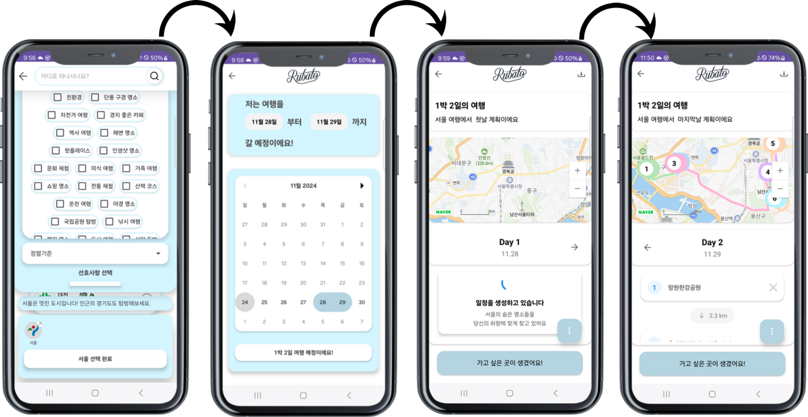
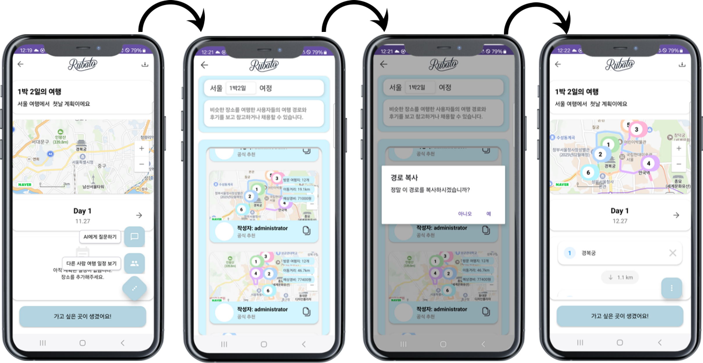
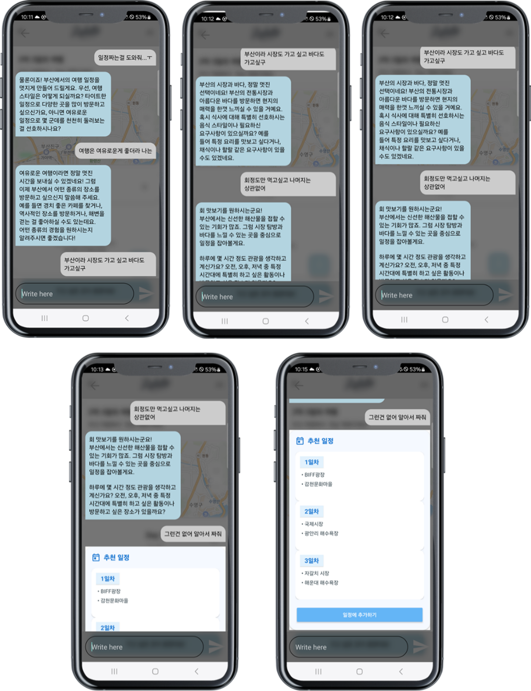
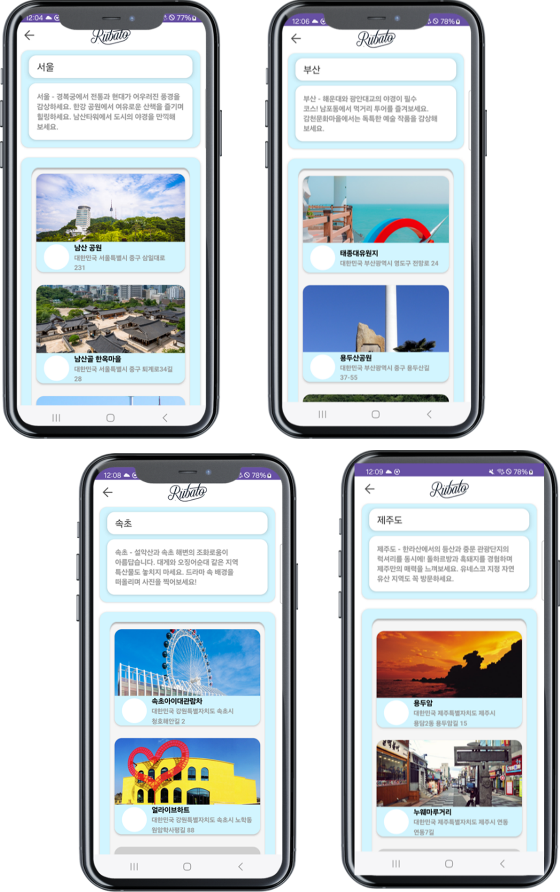

# Rubato — AI 여행 경로 추천 앱

      

**2024 LINC 3.0 캡스톤디자인 경진대회 대상** (연성대학교)

사용자의 취향 태그(미식, 출사, 가족여행 등)를 기반으로 AI가 여행 일정을 생성하고, 지도 위에 동선을 시각화해 주는 Android 앱.
5인 팀 졸업작품 — 팀장으로 기획·일정 관리(WBS)·서버 구축·AI 로직 구현을 담당했다.

## 데모

전체 시연 영상, 기능별 데모 클립, 설치용 APK: [Releases v1.0](https://github.com/deltaomega02/rubato/releases/tag/v1.0)

## 스크린샷

| 태그·날짜 선택 → 일정 생성 | 지도 경로 시각화 |
|:---:|:---:|
|  |  |
| **능동형 인터뷰 챗봇** | **지역별 장소 추천** |
|  |  |

## 기술 스택

| 영역 | 기술 | 용도 |
|---|---|---|
| 클라이언트 | Android (Java), Retrofit2 | 네이티브 앱, REST 통신 |
| 지도 | Naver Map SDK / API | 경로 마커·동선 시각화, 장소 검색 |
| 서버 | PHP, MySQL | REST API, 회원·일정 데이터 저장 |
| AI | OpenAI **GPT-4o / GPT-4o-mini** | 일정의 논리적 구성은 4o, 라우팅 판정·장소 요약은 mini |
| AI | Google **Gemini 1.5 Pro** (검색 grounding) | 실시간 정보 질의 (영업시간, 주차 등) |

## 동작 방식

### 1. 태그 기반 일정 생성

```
[앱] 여행지·기간·테마 태그 선택
  → [서버 auto_route.php] 태그를 프롬프트로 조립 → GPT-4o 호출
  → 일정 JSON (일자별 장소 목록) 파싱
  → [앱] Naver Map 위에 순서대로 마커 + 동선 렌더링
```

### 2. 하이브리드 AI 챗봇 — 이 프로젝트의 핵심 설계

채팅으로 일정을 다듬다가 "이 식당 오늘 영업시간은?" 같은 **실시간 정보** 질문이 나오면,
학습 데이터에 의존하는 GPT는 답하지 못하거나 할루시네이션을 낸다.

```
[chat_main.php] 사용자 메시지 수신
  │  ← 어느 쪽인지 판정하는 것 자체는 GPT-4o-mini (싼 모델로 충분한 분류 작업)
  ├─ 일정 구성·수정 질의  → GPT-4o          (auto_route.php / chat_route.php / save_route.php)
  └─ 실시간 정보 질의     → Gemini 1.5 Pro  (chat_search.php, 검색 grounding)
```

검증된 GPT 일정 생성 프롬프트는 유지하면서, 최신 정보가 필요한 질의만 Gemini의
검색 grounding으로 보낸다. 모델 교체가 아니라 **작업별 최적 모델 배치**로 해결했다.

여기에 한 층 더 있다 — **판정·요약처럼 가벼운 작업은 `gpt-4o-mini`, 실제 일정 생성처럼
품질이 필요한 작업만 `gpt-4o`** 로 나눴다. 라우팅 판정(`chat_main.php`), 장소 요약
(`get_place.php`), 재추천(`recomment.php`)이 mini 쪽이다. 모든 호출을 4o 로 보냈다면
비용이 세 배 이상 났을 구조다.

### 3. 서버 API 구성

| 엔드포인트 | 역할 |
|---|---|
| `auto_route.php` | 태그 기반 AI 일정 자동 생성 |
| `chat_main.php` / `chat_route.php` | 챗봇 대화 · 챗봇 기반 일정 수정 |
| `chat_search.php` | 실시간 정보 검색 (Gemini) |
| `get_place.php` | 장소 검색·상세 정보 |
| `save_route.php` | 일정 저장/불러오기 |
| `recomment.php` | 장소 재추천 |

## 프로젝트 구조

```
rubato/
├── Rubato_Application/        # Android 앱
│   └── app/src/main/java/com/ysu/capstone/
│       ├── TripPlanner1~3     # 일정 생성 플로우 (태그 → 생성 → 확인)
│       ├── ChatActivity       # AI 챗봇
│       ├── network/           # Retrofit 클라이언트, 요청/응답 모델
│       ├── chat/              # 채팅 메시지 모델·어댑터
│       ├── decorators/        # 캘린더 날짜 데코레이터, 슬라이더
│       └── topsheet/          # 커스텀 TopSheet UI
├── Rubato_Server/             # PHP API 서버
└── docs/                      # 기능명세서·WBS, 화면설계서, 테이블명세서, ERD, 발표자료
```

## 실행

1. `Rubato_Server/`를 PHP + MySQL 환경에 배포하고, 각 PHP 파일의 `YOUR_..._KEY` placeholder에 본인 키(OpenAI, Gemini, Naver) 설정
2. `docs/RUBATO_테이블명세서.xlsx` 기준으로 DB 스키마 생성
3. `Rubato_Application/`을 Android Studio로 열고 `strings.xml`의 Naver 키 설정 후 빌드

> 공개 저장소의 모든 API 키·DB 접속 정보는 placeholder로 대체되어 있다.

## 한계와 배운 것

- PHP 엔드포인트별 파일 구조는 공통 로직(인증·DB 연결) 중복을 낳았다 — 다음 졸업작품(Orbit)에서 Django REST로 전환한 직접적 이유.
- AI 응답의 JSON 형식 안정성을 프롬프트로만 통제했다 — 지금이라면 structured output 기능을 쓸 것.
